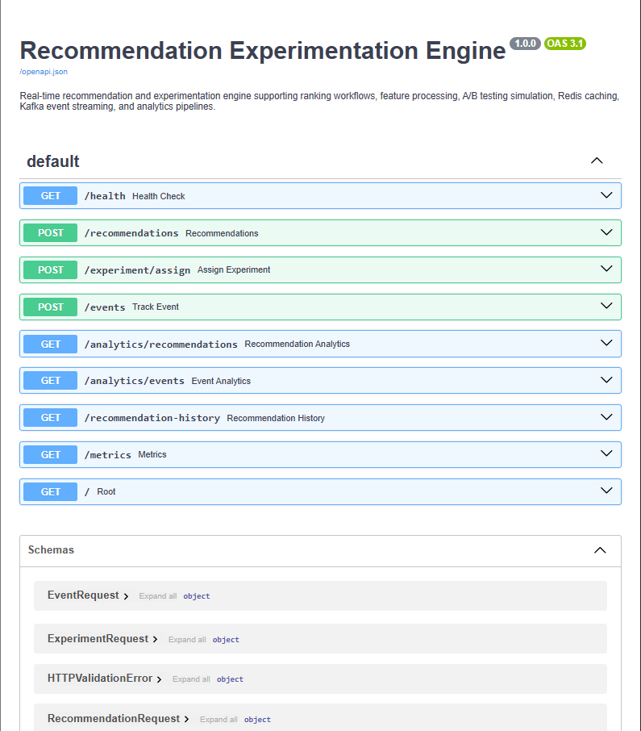
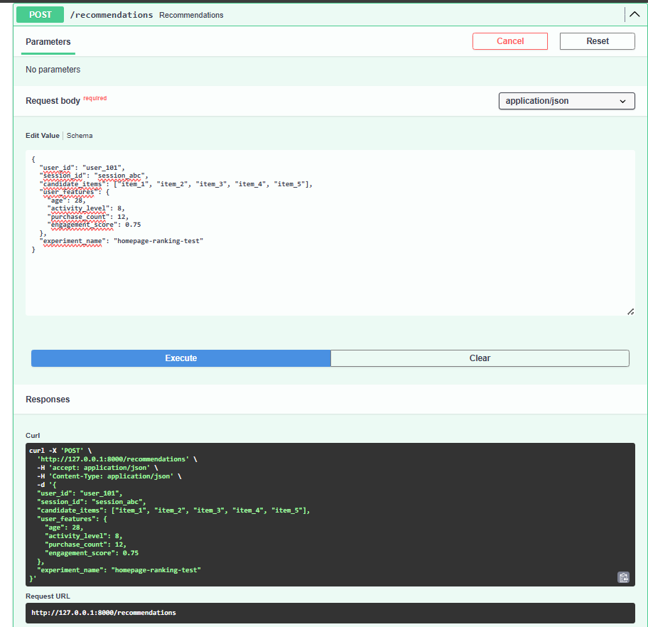
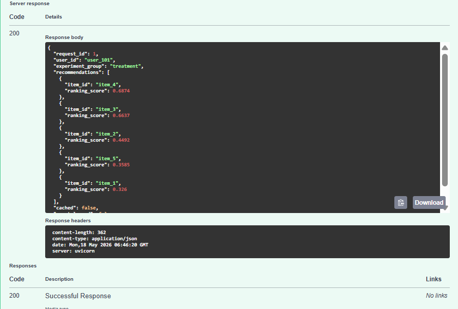
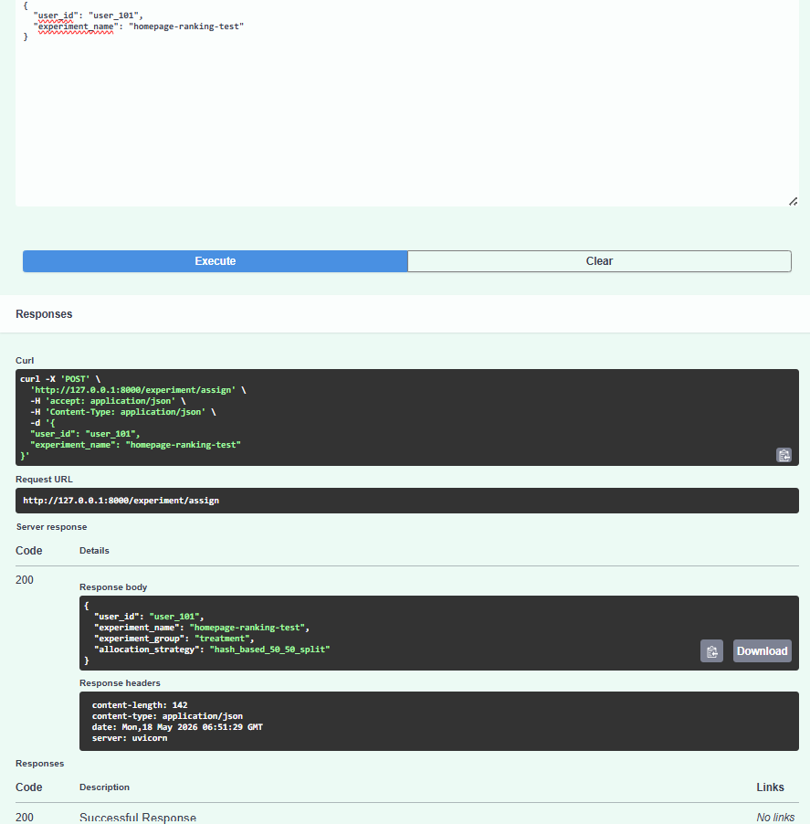
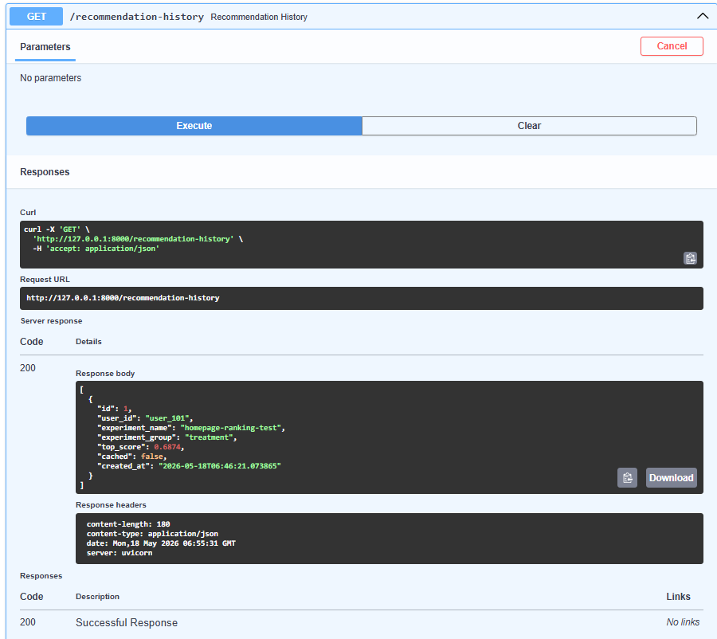
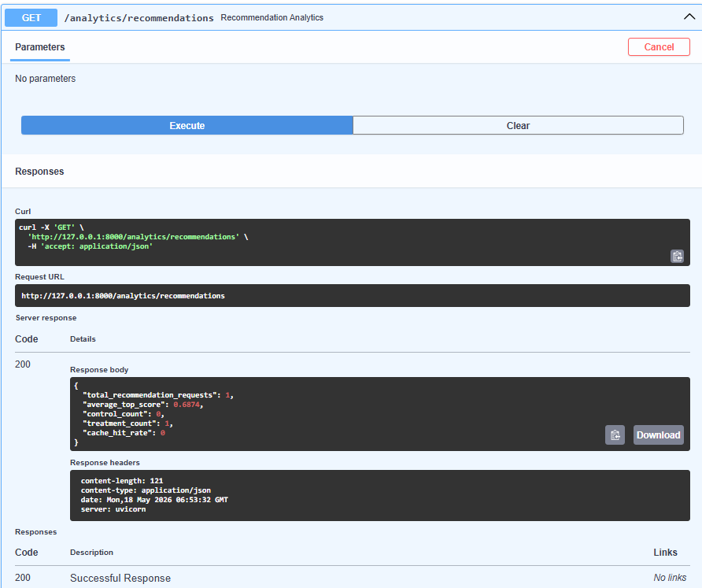
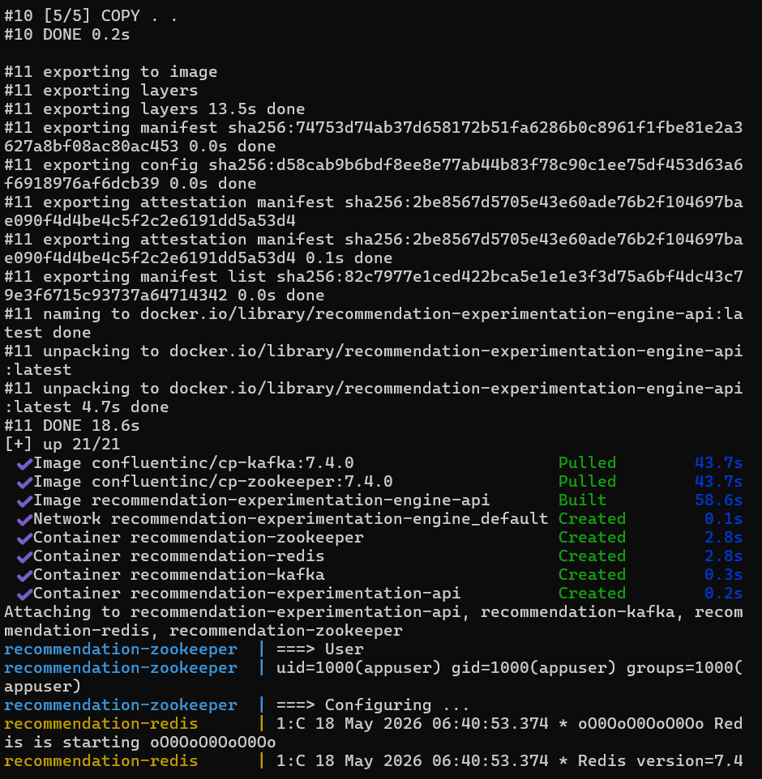

# Recommendation Experimentation Engine


Real-time recommendation and experimentation engine built using FastAPI, Redis, Kafka, PostgreSQL, and Docker supporting recommendation ranking workflows, feature processing pipelines, A/B testing simulation, event streaming, analytics tracking, caching systems, and production-style backend infrastructure.

---

# Features

- Real-time recommendation APIs
- Recommendation ranking engine
- User feature processing
- A/B testing simulation workflows
- Redis caching integration
- Kafka event streaming support
- Recommendation analytics pipelines
- PostgreSQL database integration
- Async event processing
- Prometheus monitoring metrics
- Dockerized deployment
- CI/CD automation using GitHub Actions
- Production-style backend architecture
- REST API workflows

---

# Tech Stack

## Backend
- FastAPI
- Python
- Uvicorn

## Database
- PostgreSQL
- SQLAlchemy

## Caching
- Redis

## Streaming
- Apache Kafka
- Zookeeper

## Monitoring
- Prometheus

## DevOps
- Docker
- Docker Compose
- GitHub Actions

---

# Project Structure

```bash
recommendation-experimentation-engine/
│
├── .github/
│   └── workflows/
│       └── python-ci.yml
│
├── app/
│   ├── analytics/
│   │   ├── __init__.py
│   │   └── metrics_service.py
│   │
│   ├── api/
│   │   ├── __init__.py
│   │   ├── routes.py
│   │   └── schemas.py
│   │
│   ├── cache/
│   │   ├── __init__.py
│   │   └── redis_client.py
│   │
│   ├── database/
│   │   ├── __init__.py
│   │   ├── connection.py
│   │   └── models.py
│   │
│   ├── experimentation/
│   │   ├── __init__.py
│   │   ├── ab_testing.py
│   │   └── experiment_service.py
│   │
│   ├── monitoring/
│   │   ├── __init__.py
│   │   └── prometheus_metrics.py
│   │
│   ├── recommendation/
│   │   ├── __init__.py
│   │   ├── feature_processor.py
│   │   ├── ranking_engine.py
│   │   └── recommendation_service.py
│   │
│   ├── streaming/
│   │   ├── __init__.py
│   │   └── kafka_producer.py
│   │
│   ├── utils/
│   │   ├── __init__.py
│   │   └── logger.py
│   │
│   ├── workers/
│   │   ├── __init__.py
│   │   └── event_processor.py
│   │
│   ├── __init__.py
│   └── main.py
│
├── Screenshots/
│   ├── analytics-summary.png
│   ├── api-docs.png
│   ├── docker-running.png
│   ├── experiment-assignment.png
│   ├── recommendation-history.png
│   ├── recommendation-response.png
│   └── recommendation-server-response.png
│
├── tests/
│   └── test_health.py
│
├── .gitignore
├── docker-compose.yml
├── Dockerfile
├── README.md
└── requirements.txt
```

---

# API Endpoints

| Method | Endpoint | Description |
|--------|----------|-------------|
| GET | `/health` | Health check endpoint |
| POST | `/recommendations` | Generate recommendations |
| POST | `/experiment/assign` | Assign A/B experiment group |
| POST | `/events` | Track recommendation events |
| GET | `/analytics/recommendations` | Recommendation analytics |
| GET | `/analytics/events` | Event analytics |
| GET | `/recommendation-history` | Retrieve recommendation history |
| GET | `/metrics` | Prometheus metrics endpoint |
| GET | `/` | Root endpoint |

---

# Run Locally

## Clone Repository

```bash
git clone https://github.com/koteshbabubommana/recommendation-experimentation-engine.git
```

---

## Move Into Project

```bash
cd recommendation-experimentation-engine
```

---

## Install Dependencies

```bash
pip install -r requirements.txt
```

---

## Run Application

```bash
python -m uvicorn app.main:app --reload
```

Application runs at:

```bash
http://127.0.0.1:8000
```

Swagger API Docs:

```bash
http://127.0.0.1:8000/docs
```

---

# Docker Deployment

## Start Complete Infrastructure

```bash
docker-compose up --build
```

This starts:
- FastAPI backend
- Redis cache
- Kafka broker
- Zookeeper
- PostgreSQL database

---

# Sample Recommendation Request

```json
{
  "user_id": "user_101",
  "session_id": "session_abc",
  "candidate_items": ["item_1", "item_2", "item_3", "item_4", "item_5"],
  "user_features": {
    "age": 28,
    "activity_level": 8,
    "purchase_count": 12,
    "engagement_score": 0.75
  },
  "experiment_name": "homepage-ranking-test"
}
```

---

# Sample Recommendation Response

```json
{
  "request_id": 1,
  "user_id": "user_101",
  "experiment_group": "treatment",
  "recommendations": [
    {
      "item_id": "item_4",
      "ranking_score": 0.6874
    },
    {
      "item_id": "item_3",
      "ranking_score": 0.6637
    }
  ],
  "cached": false
}
```

---

# Screenshots

## API Documentation



---

## Recommendation API Response



---

## Recommendation Server Response



---

## Experiment Assignment API



---

## Recommendation History API



---

## Analytics Summary API



---

## Docker Infrastructure Running



---

# CI/CD Pipeline

GitHub Actions workflow automatically:
- installs dependencies
- runs automated tests
- validates API workflows
- verifies backend builds
- checks Docker integration

---

# Future Improvements

- Real-time recommendation retraining
- Advanced ranking algorithms
- Kafka consumer pipelines
- Grafana dashboards
- Kubernetes deployment
- Cloud-native deployment support
- Authentication and authorization
- Personalized recommendation models
- Feature store integration

---

# Author

**Kotesh Babu Bommana**

- GitHub: https://github.com/koteshbabubommana
- LinkedIn: https://www.linkedin.com/in/kotesh-babu-bommana
